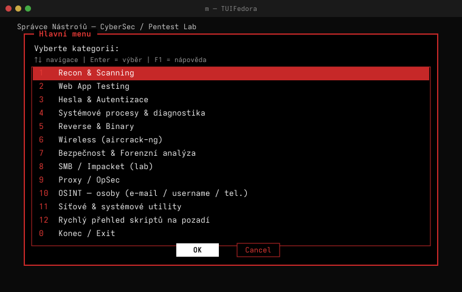
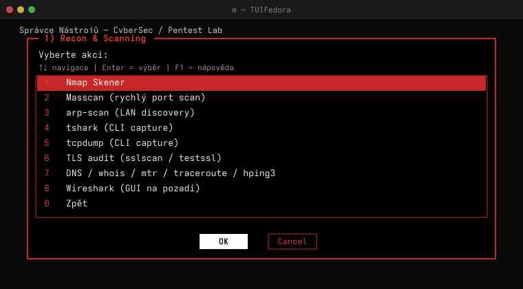

# Fedora SecuriTUI — TUI Správce Nástrojů

Interaktivní bash menu (`whiptail` / `dialog`) pro spouštění diagnostických, bezpečnostních a pentest nástrojů na **Fedora KDE**.

Spuštění jedním písmenem: **`m`**

Open source pod licencí **GPL-2.0-or-later** (`LICENSE`).
Článek: <https://svec-elektro.cz/projekty/fedora-securitui/>

*Veřejný snapshot — vývoj probíhá v privátním repozitáři, historie commitů je zde squashnutá.*

## Screenshoty

| Hlavní menu | Recon & Scanning |
|---|---|
|  |  |

---

## Struktura projektu

```
TUIFedora/
├── menu.sh                  # hlavní TUI menu
├── install-pentest-tools.sh # instalace CLI balíčků (dnf + pipx)
├── setup.sh                 # alias m + symlinky do $HOME
├── config/
│   └── dialogrc             # tmavé téma pro dialog
└── README.md
```

---

## Rychlá instalace

```bash
# Rozbalte ZIP a přejděte do složky projektu
cd ~/Downloads/TUIFedora   # nebo kam jste archiv rozbalili

# 1) Nainstalovat nástroje (volitelné, jednorázově)
bash install-pentest-tools.sh

# 2) Nastavit alias m
bash setup.sh

# 3) Spustit menu (nový terminál)
m
```

Stažení: [svec-elektro.cz/projekty/tuifedora](https://svec-elektro.cz/projekty/tuifedora/)

---

## Hlavní menu — kategorie

| # | Sekce | Obsah |
|---|--------|--------|
| 1 | Recon & Scanning | nmap, masscan, arp-scan, tshark, tcpdump, TLS, DNS, Wireshark |
| 2 | Web App Testing | ffuf, gobuster, whatweb, wafw00f, nuclei, subfinder, sqlmap |
| 3 | Hesla & Autentizace | hydra, medusa, ncrack, john, hashcat |
| 4 | Systémové procesy | strace, ltrace, GDB |
| 5 | Reverse & Binary | radare2, checksec, binwalk, yara, strings, objdump |
| 6 | Wireless | aircrack-ng suite, hcxpcapngtool |
| 7 | Bezpečnost & Forenzní | lynis, Sleuthkit, AIDE, rkhunter, ClamAV, volatility3, foremost |
| 8 | SMB / Impacket | smbclient, impacket skripty (lab) |
| 9 | Proxy / OpSec | proxychains, tor |
| 10 | OSINT — osoby | holehe, maigret, sherlock, phoneinfoga, socid_extractor, cupp |
| 11 | Síťové utility | ss, ncat, socat, curl, ip, nft, openssl, docker |
| 12 | Skripty na pozadí | ps aux \| grep .sh/.py |

---

## Závislosti

**TUI (povinné):**
```bash
sudo dnf install -y dialog newt    # dialog preferován, whiptail záloha
```

**Pentest balíčky:** viz `install-pentest-tools.sh`

**OSINT (pipx / ~/.local/bin):**
- holehe, maigret, phoneinfoga, socid_extractor, cupp
- sherlock (dnf)

---

## Vzhled (tmavé téma)

- Pozadí terminálu a okna: **černé**
- Text: **bílý**, okraje/titulky: **červené**
- Aktivní položka menu: **bílá na červené**
- Tlačítka (dialog): neaktivní = červený text, aktivní = **černý na bílém**

Téma: `config/dialogrc` → při startu kopírováno do `~/.config/menu/dialogrc`

Whiptail barvy: proměnná `NEWT_COLORS` v `menu.sh`

---

## Vývoj / úpravy

1. Naklonuj repozitář: `git clone https://github.com/pauliquib/Fedora-SecuriTUI.git && cd Fedora-SecuriTUI`
2. Uprav `menu.sh` nebo `config/dialogrc` v libovolném editoru
3. Test: `bash menu.sh` nebo `m` (po `setup.sh`)

Po změně `config/dialogrc` stačí znovu spustit menu — soubor se automaticky synchronizuje.

---

## Alias m

| Shell | Soubor |
|-------|--------|
| Fish (výchozí) | `~/.config/fish/config.fish` |
| Bash | `~/.bashrc` |

`setup.sh` nastaví alias na absolutní cestu k `menu.sh` v tomto projektu.

---

## Právní upozornění

Nástroje pro pentest a OSINT používej **pouze** na systémech, kde máš **písemné povolení**, nebo ve **vlastním labu**. Autor menu nenese odpovědnost za zneužití.

---

## Řešení problémů

| Problém | Řešení |
|---------|--------|
| Menu se nespustí po instalaci dialog | Opraveno v `config/dialogrc` — spusť znovu `setup.sh` |
| Světlé pozadí | Použij `dialog` (ne whiptail): `sudo dnf install dialog` |
| Chybí nástroj v menu | `bash install-pentest-tools.sh` |
| Alias m nefunguje | `bash setup.sh` + nový terminál |
